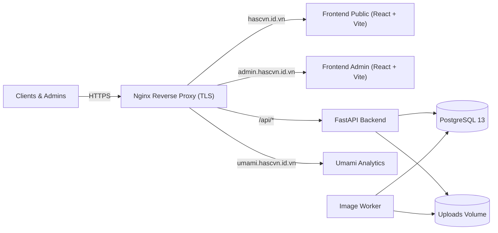

# HASC VN — Industrial Product Catalog & Management System

> Modern, full-stack bilingual product catalog and digital management platform for **HASC VN**, an industrial supplier in Vietnam specializing in packaging films, paint spray equipment, paper chemicals, and filtration systems.

[](https://github.com/lystiger/HASC/actions/workflows/ci.yml)

---

## 🌐 Live Deployments

| Service | Live Link | Description |
|---|---|---|
| **Public Catalog** | [**https://hascvn.id.vn**](https://hascvn.id.vn) | Customer-facing responsive product catalog with bilingual support (VI / EN), search, category filtering, and image galleries |
| **Admin Portal** | [**https://admin.hascvn.id.vn**](https://admin.hascvn.id.vn) | Management dashboard for catalog administrators (product CRUD, multipart image uploads, category management, task tracking) |
| **Umami Analytics** | [**https://umami.hascvn.id.vn**](https://umami.hascvn.id.vn) | Privacy-friendly, self-hosted traffic analytics for public and admin portals |
| **REST API** | [**https://hascvn.id.vn/api/v1/products**](https://hascvn.id.vn/api/v1/products) | Production FastAPI backend endpoints (documented via OpenAPI / Swagger) |
| **Health Check** | [**https://hascvn.id.vn/health**](https://hascvn.id.vn/health) | Live system readiness and health probe |

---

## 🚀 Key Features

- **Asynchronous Image Processing Pipeline**:
  - High-resolution multipart uploads with automated file validation and staging.
  - Background worker (`hasc-worker`) processes raw images into responsive WebP web formats and optimized thumbnails using Lanczos resampling.
  - Asynchronous task queuing backed by PostgreSQL with retry mechanisms and terminal state cleanup.
- **Bilingual Localization (VI / EN)**:
  - Native bilingual schemas for all products and categories (`name_vi`, `name_en`, `description_vi`, `description_en`).
  - Real-time client-side language switching powered by `react-i18next`.
- **Automated CI/CD**:
  - GitHub Actions runs full backend pytest suite (42 tests), frontend ESLint & TypeScript compilation, Vite production build, and Docker image validation.
  - Dedicated self-hosted runner configured directly on the Cloud VPS for automated zero-downtime deployment on pushes to `main`.
- **Production Hardened**:
  - Single-VPS architecture orchestrated via Docker Compose.
  - Nginx reverse proxy with automated Let's Encrypt TLS (Certbot HTTP-01 challenge renewal).
  - Rate limiting, body size guards, CORS protection, and secure JWT authentication.

---

## 🏗️ Architecture & Tech Stack



- **Frontend**: React 18, TypeScript, Vite, Tailwind CSS, TanStack Query, React Router, `react-i18next`, Lucide Icons.
- **Backend**: FastAPI, SQLAlchemy 2.0 (asyncio + asyncpg), Alembic, Pydantic v2, Pillow, Passlib (bcrypt), Python-Jose (JWT).
- **Database**: PostgreSQL 13 (application data & task queue).
- **DevOps**: Docker, Docker Compose, GitHub Actions (Self-Hosted Runner), Nginx, Certbot.

---

## 📦 Local Development

### 1. Prerequisites
- Docker & Docker Compose
- Node.js 20+
- Python 3.11+

### 2. Environment Setup
```bash
cp .env.example .env
# Fill in your database passwords and SECRET_KEY
```

### 3. Running with Docker Compose
```bash
docker compose up --build -d
```

### 4. Database Migrations & Seeding
```bash
# Run database migrations
docker compose exec -T backend alembic upgrade head

# Seed catalog categories
docker compose exec -T backend python -m scripts.category_seed

# Seed admin account
docker compose exec -T backend python -m scripts.admin_seed --email admin@example.com --password <your_password>

# Seed products and upload catalog images
python -m scripts.product_seed --api-base-url http://localhost:8000 --email admin@example.com --password <your_password>
```

---

## 🧪 Testing

```bash
# Run backend pytest suite
docker compose exec -T backend pytest backend/tests

# Run frontend lint
cd frontend && npm run lint
```

---

## 📄 License
Internal project developed for HASC VN. All rights reserved.
